## параметры виртуальной машины в процессе создания (имя ВМ, память, диск)
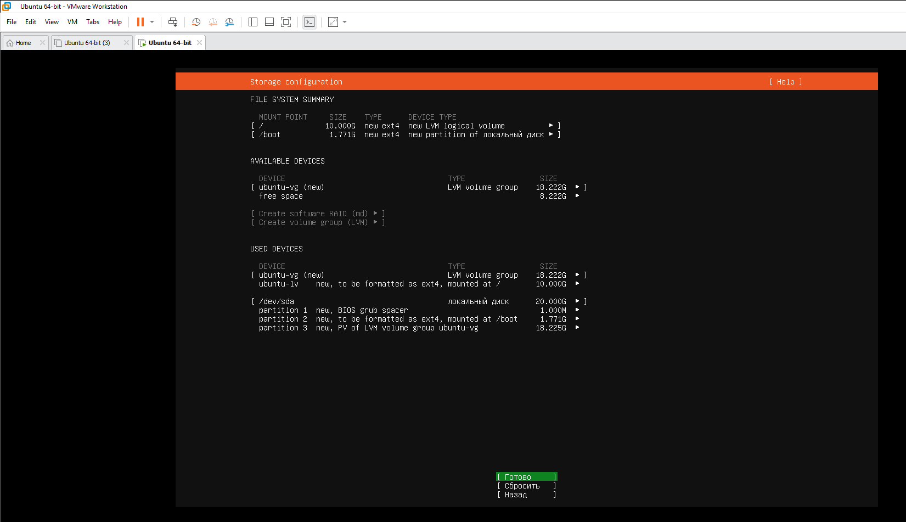

## Подключение  к PuTTY

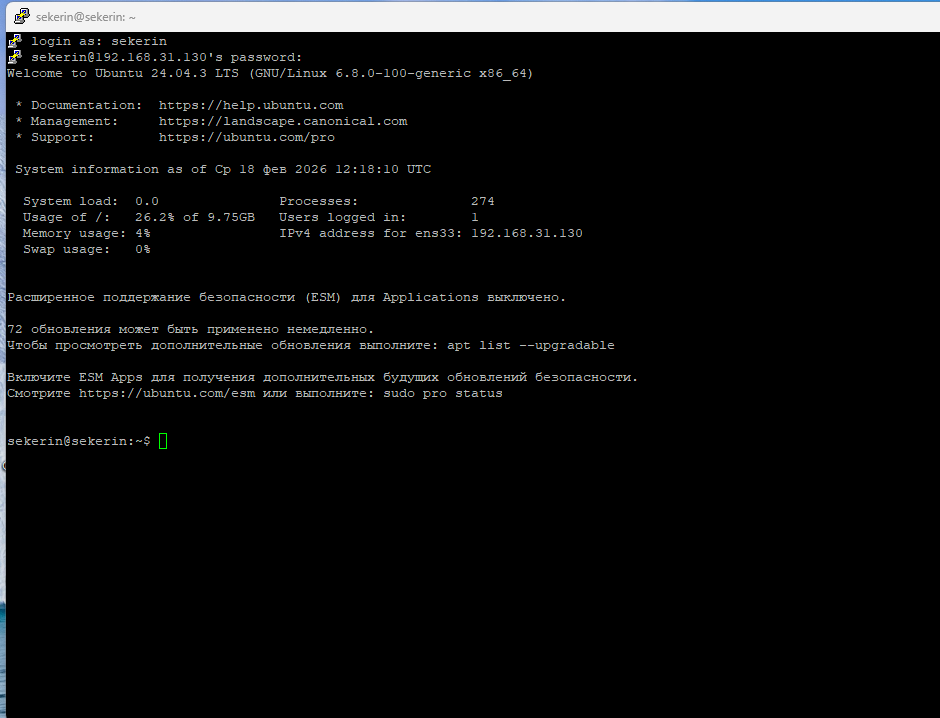

## командная строка Ubuntu после установки с приглашением фамилия@фамилия:~$

## вывод cat ~/report/01-system.txt

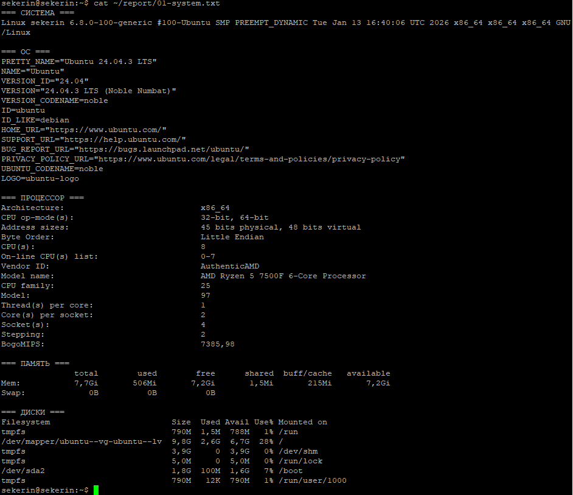

## вывод ip addr show
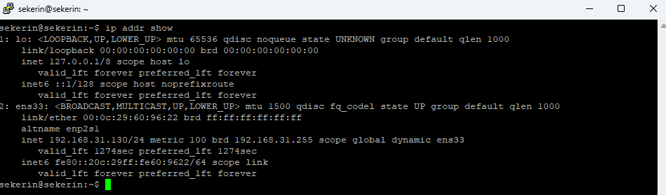
## вывод sudo ss -tlnp
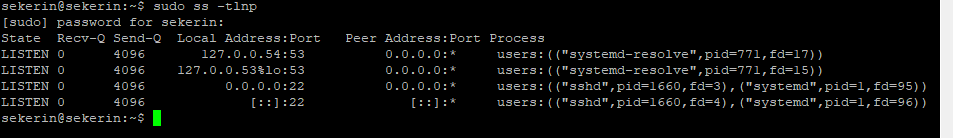
## вывод sudo systemctl status ssh
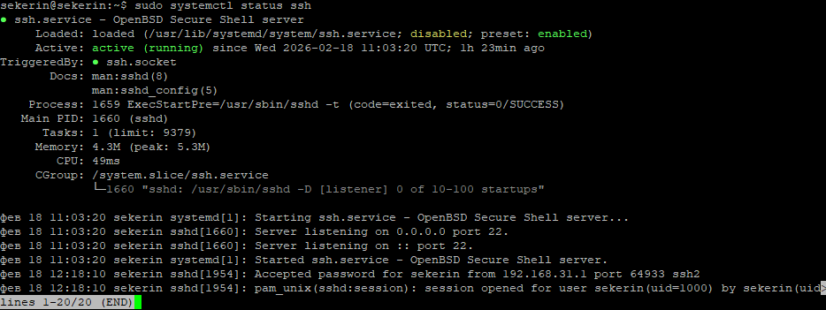
## вывод sudo ss -tlnp | grep ssh
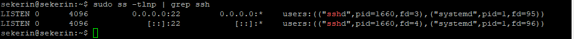
## вывод grep '/bin/bash' /etc/passwd
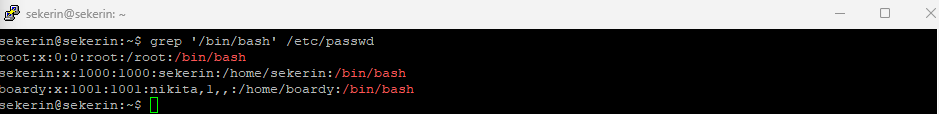
## процесс создания пользователя boardy
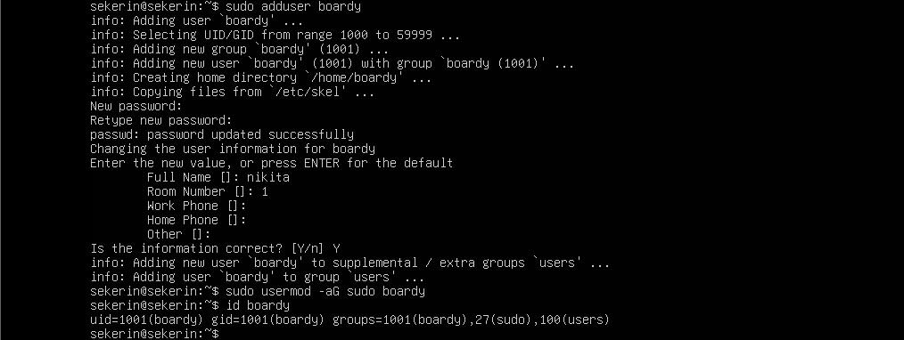
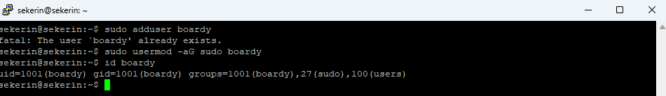
## вывод id boardy
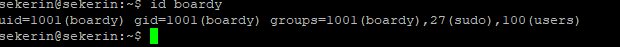
## вывод ls -la /
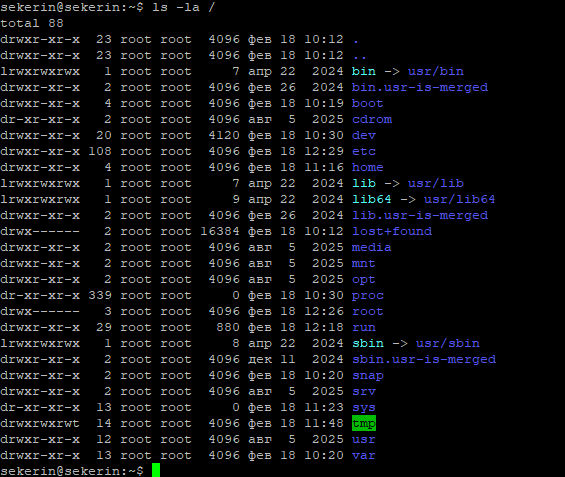
## вывод ls -la ~
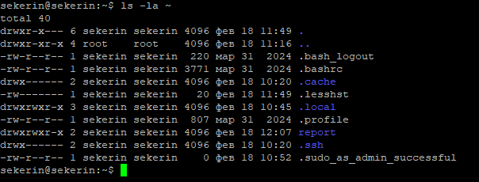
## вывод ls -ld / /etc /var /tmp /home
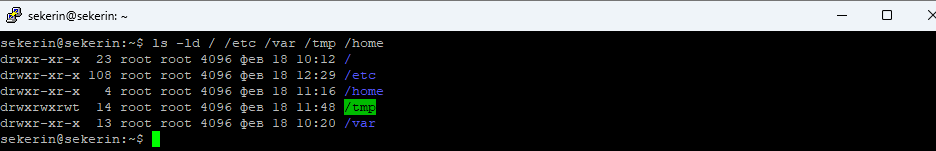
## три состояния testfile.txt (до, после chmod 755, после chmod 600)
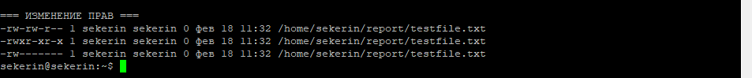
## вывод dpkg -l | grep -E 'openssh|python|git|curl|vim|nano'
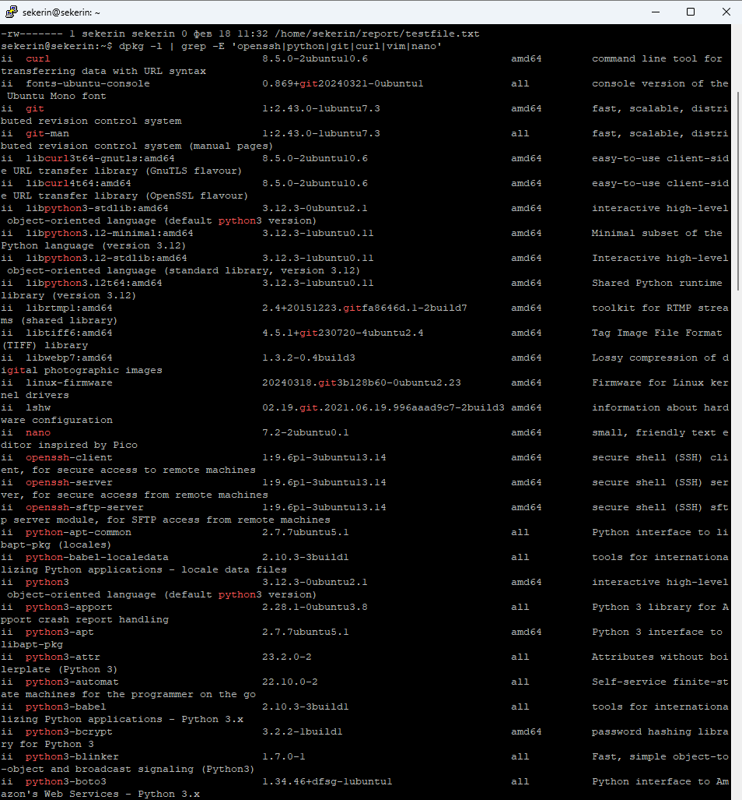
## вывод systemctl list-units --type=service --state=running
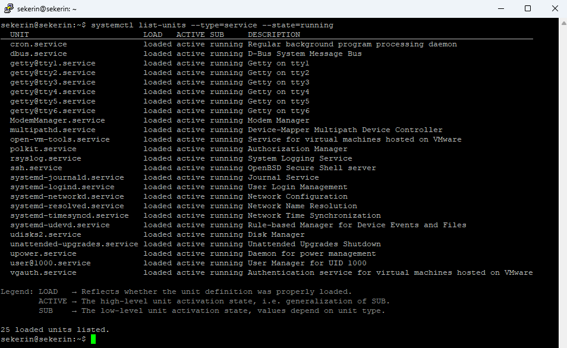
## вывод ps aux --sort=-%mem | head -11
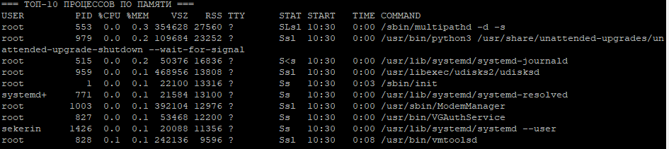
## вывод подсчёта процессов по пользователям
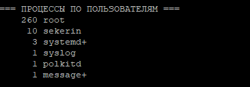
## вывод топ-10 больших файлов в /var
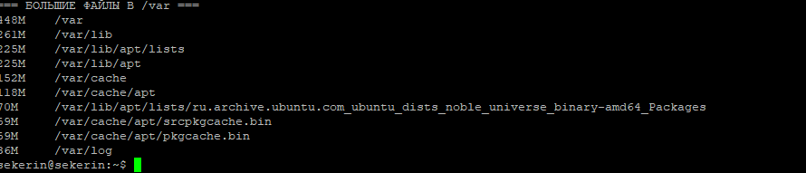
## вывод ls -lh ~/report/ со всеми файлами
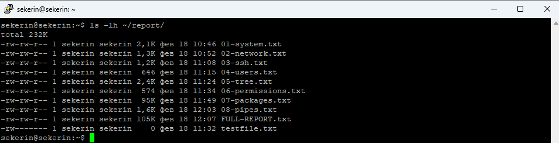