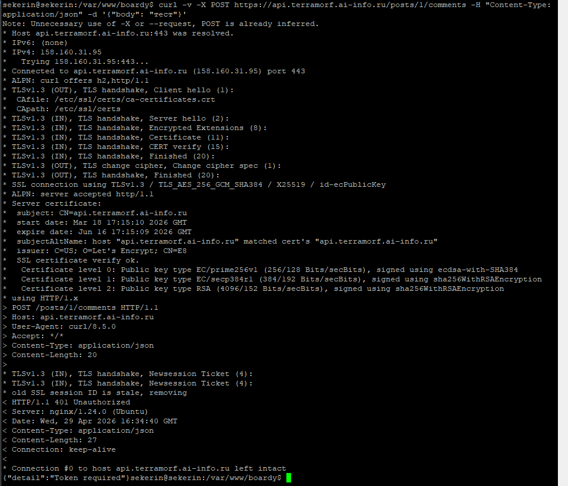
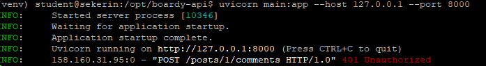
«Bearer» - это стандартная схема аутентификации RFC 6750, которая однозначно сообщает серверу формат следующих данных, позволяя корректно парсить заголовок и отличать токен доступа от других методов (Basic, Digest).

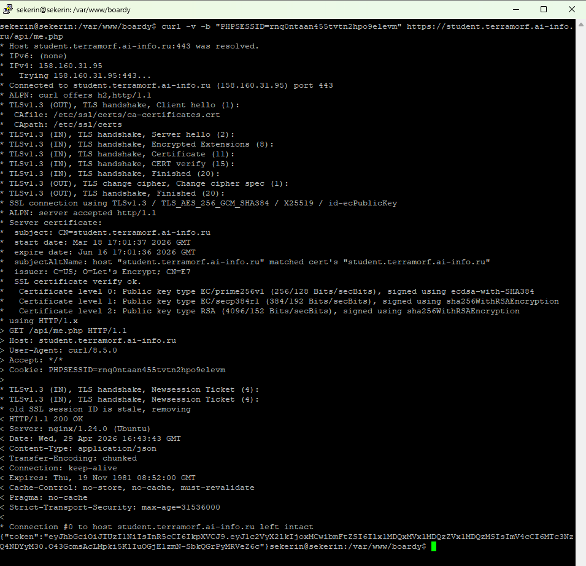
me.php опирается на session_start(), так как пользователь уже прошёл аутентификацию ранее, а кука PHPSESSID служит автоматическим ключом, который браузер отправляет на родной домен, позволяя PHP мгновенно восстановить сессию без повторного ввода учётных данных.

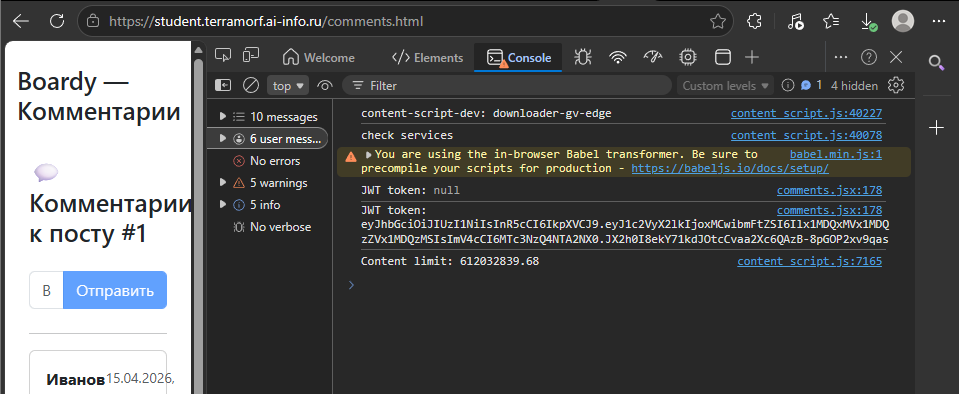

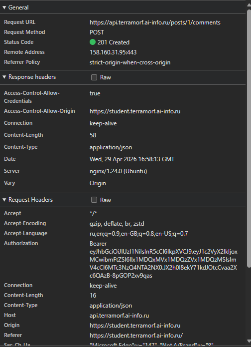

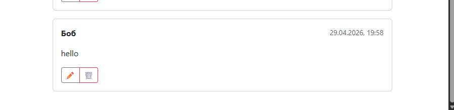

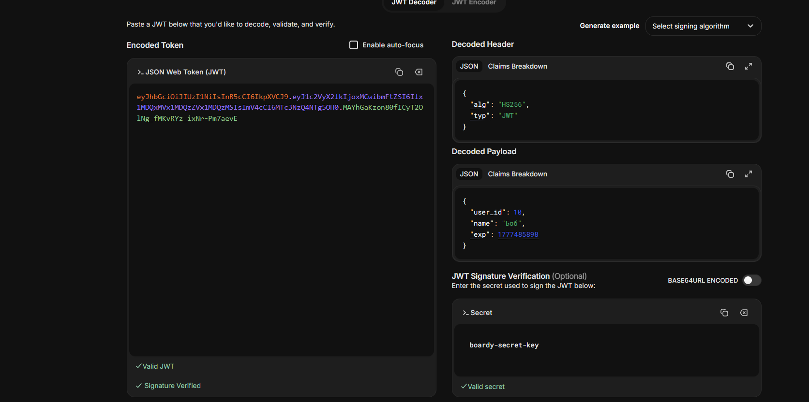
Payload только закодирован (base64url), поэтому перехвативший увидит открытые поля вроде user_id и имени, но это безопасно, так как криптографическая подпись гарантирует обнаружение любых изменений токена, а конфиденциальные данные в JWT не размещаются.

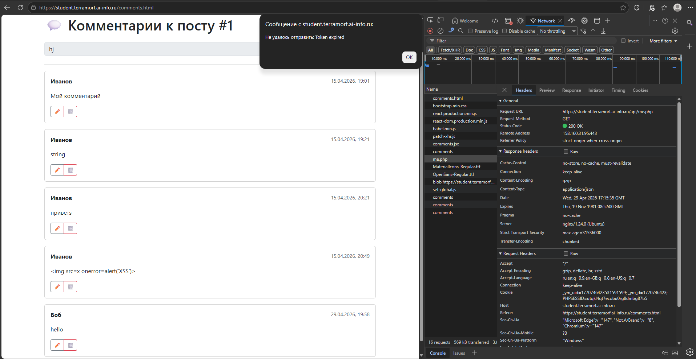

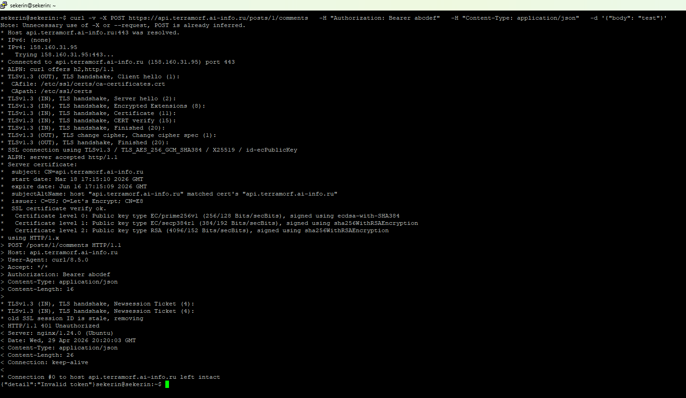

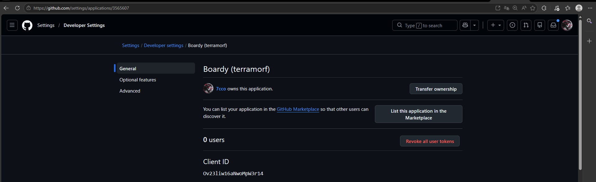

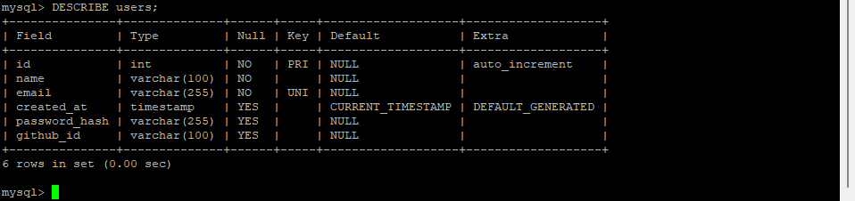

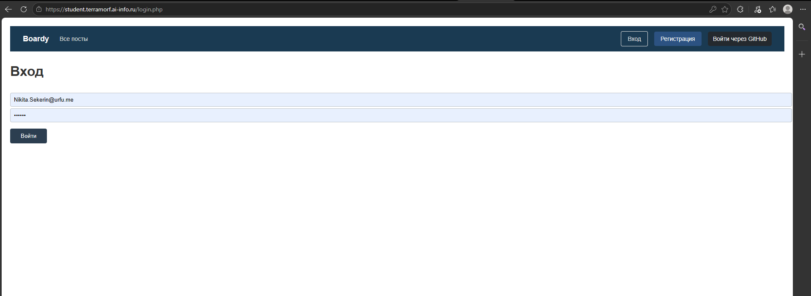

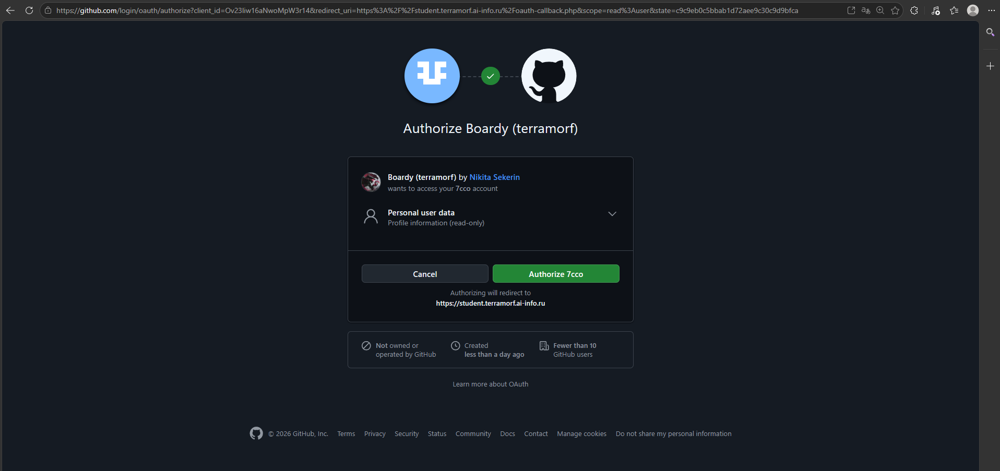

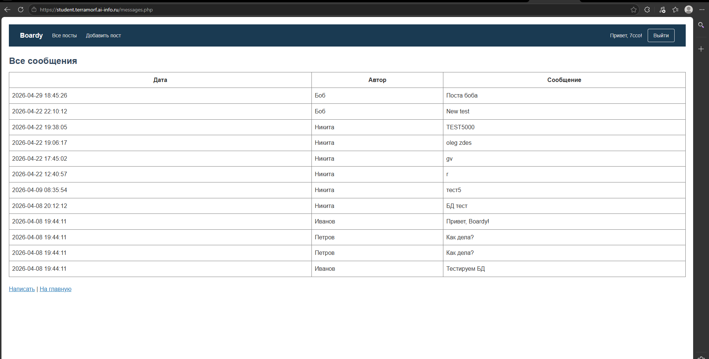

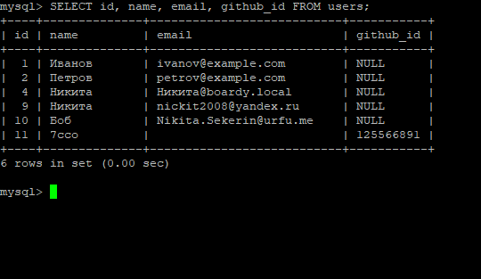
Поиск по github_id надёжнее, так как это неизменяемый системный идентификатор, в то время как email пользователь может сменить, скрыть настройками приватности или не передать приложению вовсе.

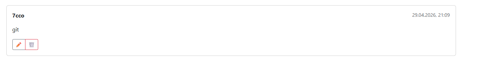
Кликает «Войти через GitHub» → oauth-github.php генерирует state и редиректит на GitHub.
GitHub авторизует и возвращает code + state на oauth-callback.php.
PHP проверяет state, обменивает code на access_token, забирает профиль и создаёт/находит пользователя в БД.
PHP сохраняет user_id в $_SESSION и редиректит на фронтенд.
React при загрузке делает fetch('/api/me.php') с кукой PHPSESSID.
PHP открывает сессию по куке, генерирует JWT из $_SESSION и возвращает токен.
React сохраняет JWT в стейт и прикрепляет его в заголовок Authorization: Bearer ... к запросам FastAPI.
FastAPI проверяет подпись токена через auth.py, извлекает user_id и сохраняет комментарий от реального автора.

state - это случайная строка, генерируемая перед редиректом на провайдера и сохраняемая в сессии для защиты от CSRF-атак путём сверки при возврате.
Сценарий атаки без state:
Злоумышленник начинает OAuth-флоу со своего аккаунта и получает временный code.
Формирует вредоносную ссылку на ваш oauth-callback.php?code=ХАКЕР_КОД и отправляет жертве.
Жертва (уже авторизованная на вашем сайте) переходит по ссылке.
Ваш callback принимает чужой code, обменивает его на токен злоумышленника и получает его github_id.
Скрипт привязывает сессию жертвы к аккаунту хакера, после чего все действия жертвы выполняются от имени злоумышленника.

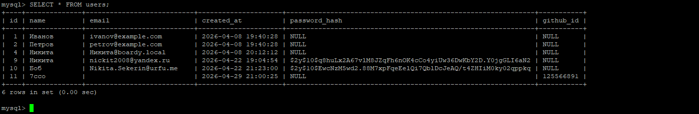

+------------------------+---------------------------+---------------------------+---------------------------+
| Вопрос                 | Куки + Сессии             | JWT                       | OAuth (GitHub)            |
+------------------------+---------------------------+---------------------------+---------------------------+
| Где хранятся данные?   | Файлы/БД на сервере       | В самом токене (клиент)   | У провайдера (GitHub)     |
+------------------------+---------------------------+---------------------------+---------------------------+
| Кто прикрепляет?       | Браузер автоматически     | Клиент (React/JS)         | Браузер (редиректы)       |
+------------------------+---------------------------+---------------------------+---------------------------+
| Для каких клиентов?    | SSR, SPA (тот же домен)   | SPA, Mobile, Cross-domain | Любые (единый вход)       |
+------------------------+---------------------------+---------------------------+---------------------------+
| Можно ли отозвать?     | Да (уничтожить сессию)    | Нет (ждать истечения)     | Да (в настройках GitHub)  |
+------------------------+---------------------------+---------------------------+---------------------------+
| Кросс-доменно?         | Нет (ограничение CORS)    | Да (заголовок Auth)       | Да (протокол OAuth2)      |
+------------------------+---------------------------+---------------------------+---------------------------+

Секрет в коде: Опасен утечкой через Git и подделкой токенов, решается пакетом Passport (RSA-ключи хранятся в файлах, добавляются в .gitignore).
Нет механизма отзыва: Опасен тем, что заблокированный пользователь сохраняет доступ до истечения срока JWT, решается Passport (таблица oauth_access_tokens с флагом revoked для мгновенной инвалидации).
Ручная CSRF-защита (state): Опасна человеческим фактором (забыли проверить → дыра), решается Socialite (автоматическая генерация, хранение и строгая верификация state внутри пакета).