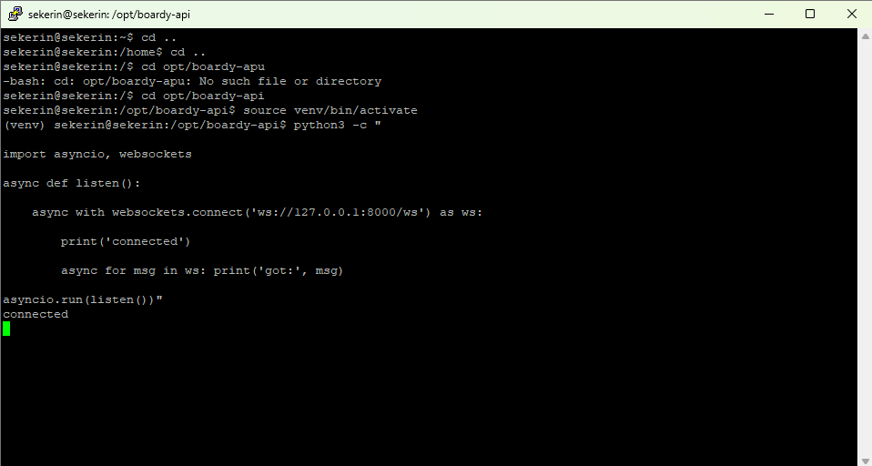
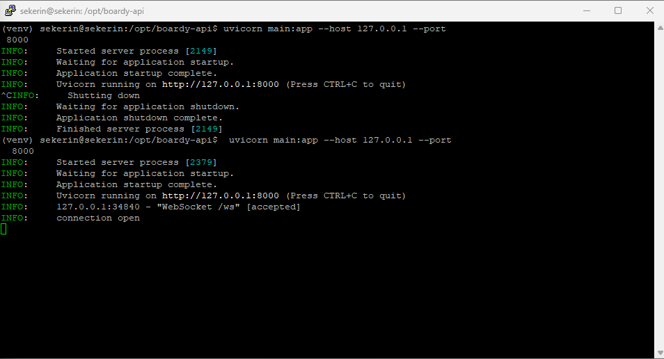
Список хранится в памяти, потому что WebSocket-соединения являются временными и состояние «онлайн» теряется при разрыве связи, поэтому сохранять их в БД избыточно и медленно. При перезапуске Uvicorn вся память очищается, все активные соединения разрываются, и клиентам потребуется переподключиться заново.

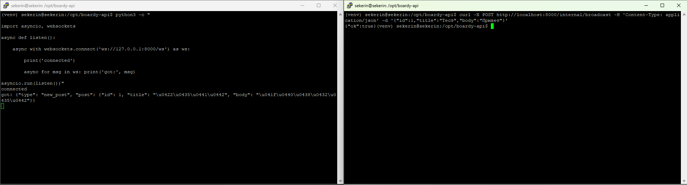
Эндпоинт не требует JWT, так как он предназначен только для внутреннего доверенного общения между сервисами (например, Laravel -> FastAPI), где проверка токенов создала бы лишнюю нагрузку. Риск внешнего вызова закрывает Nginx директивой deny all.

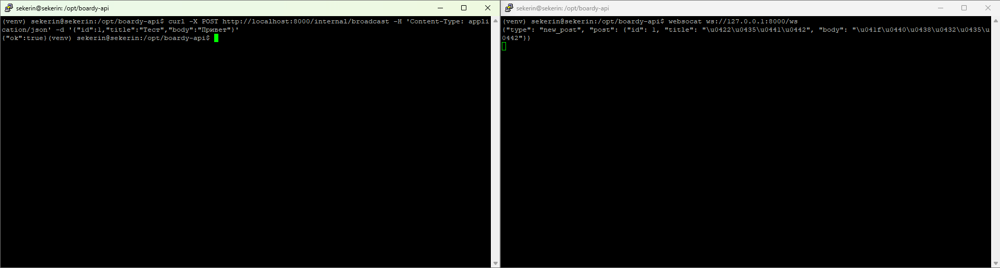
Если клиент отключится во время рассылки, попытка отправить ему данные вызовет исключение, которое мы обрабатываем блоком try/except в файле routers/ws.py, не активные перемещаем в список dead, попавшие в этот список затем стираются из общего списка self.active

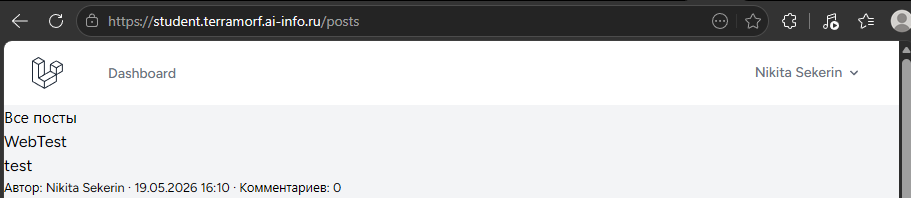
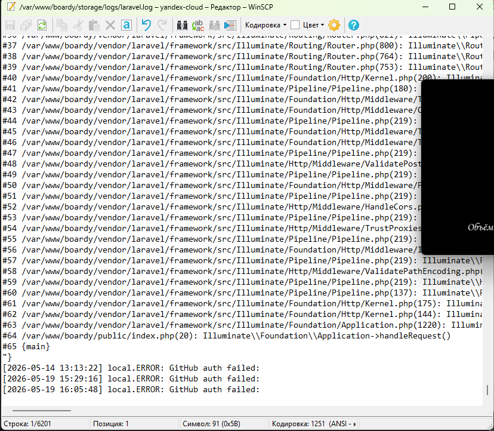
Таймаут нужен, чтобы PHP-скрипт не зависал бесконечно в ожидании ответа от FastAPI, если тот упал или перегружен. Без таймаута процесс PHP будет блокироваться до исчерпания лимита времени выполнения скрипта (max_execution_time), что приведет к накоплению процессов и отказу веб-сервера.

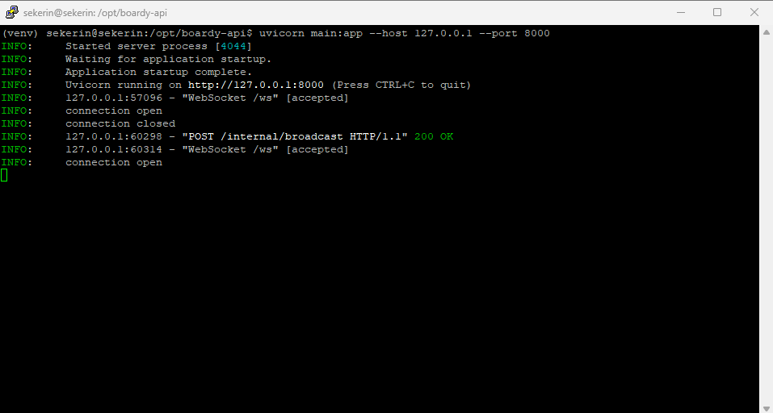
Это «костыль», так как HTTP является однонаправленным протоколом: сервер не может инициировать соединение, поэтому клиент вынужден постоянно опрашивать сервер или держать открытым сложное долгосрочное соединение. Основные проблемы: высокая задержка доставки сообщений (polling), лишняя нагрузка на сеть и сервер из-за частых пустых запросов, а также сложность поддержки состояния сессии при разрывах связи.

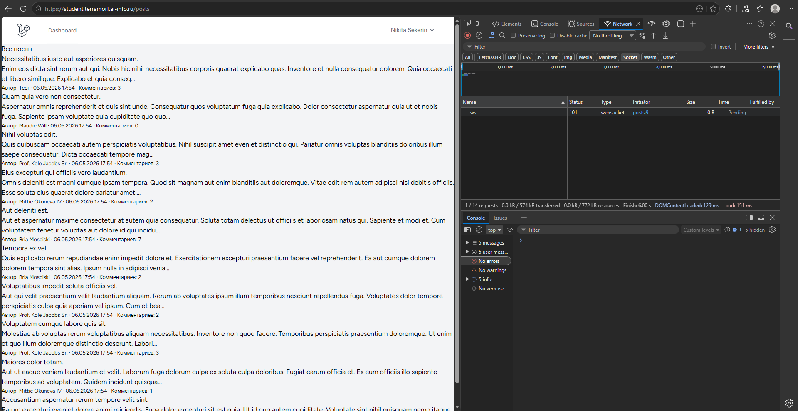
На локалке используется ws://, так как наша локалка находится на обычном HTTP, а сайт на HTTPS и если попытаться подключиться с защищённого https:// на незащищённый ws:// браузер запретит подключение. Протокол wss ожидает, что сначала пройдет рукопожатие TLS (SSL handshake). Если сервер не поддерживает TLS (отдает обычный HTTP/WS трафик), клиент не сможет расшифровать ответ и соединение оборвется с ошибкой протокола или таймаутом.

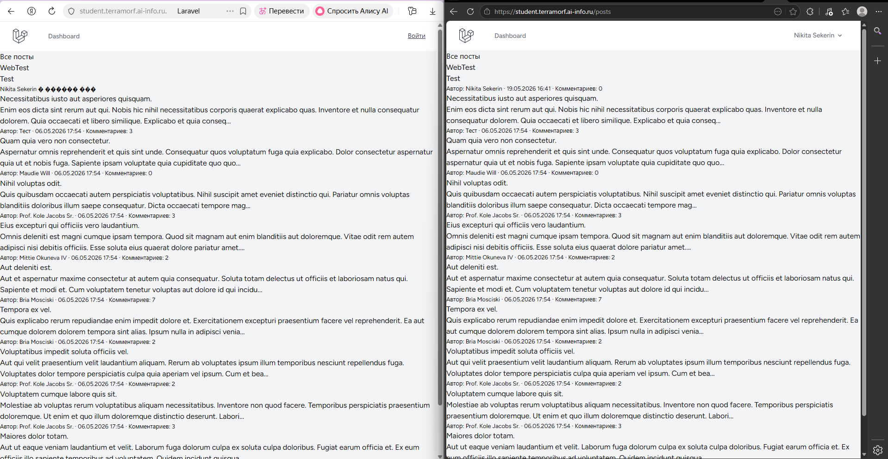
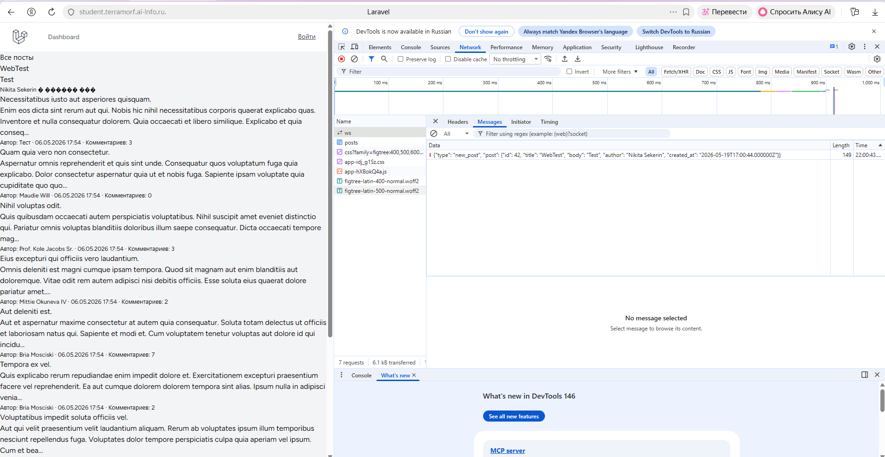

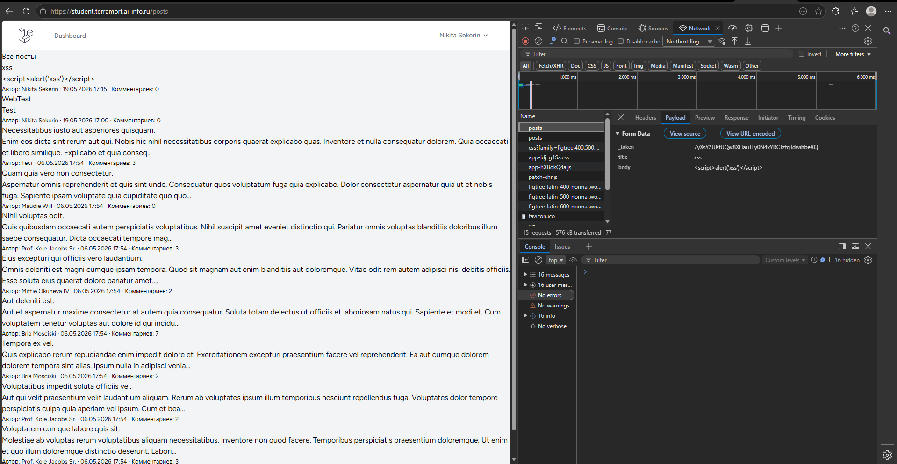
Функция заменяет специальные символы (например, <, >, &) на HTML-сущности, предотвращая интерпретацию введенного текста как исполняемого кода. Если вставлять данные напрямую в innerHTML без экранирования, можно будет внедрить вредоносный JavaScript (XSS-атака), который выполнится в браузере жертвы.

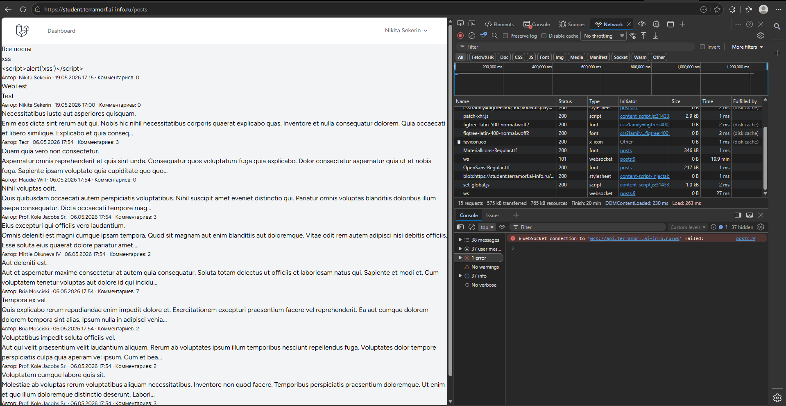

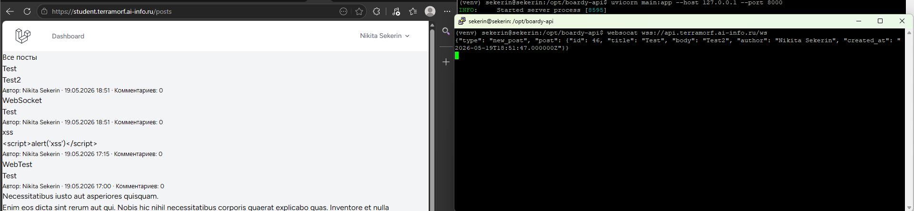
Без proxy_http_version 1.1 Nginx использует HTTP/1.0, который не поддерживает заголовок Upgrade, и соединение останется обычным HTTP. Без proxy_set_header Upgrade сервер не поймет, что нужно переключиться на WebSocket, а отсутствие proxy_read_timeout приведет к разрыву соединения при отсутствии активности в течение стандартных 60 секунд.

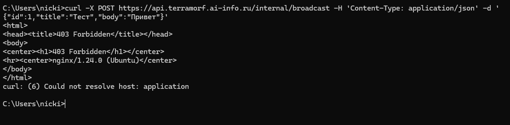
Эндпоинт опасен тем, что позволяет любому пользователю интернета отправлять массовые уведомления или команды всем подключенным клиентам, что ведет к спаму, фишингу или DoS-атаке. Вызвать его мог бы кто угодно, зная URL, поэтому доступ жестко ограничен по IP (только 127.0.0.1) на уровне веб-сервера.