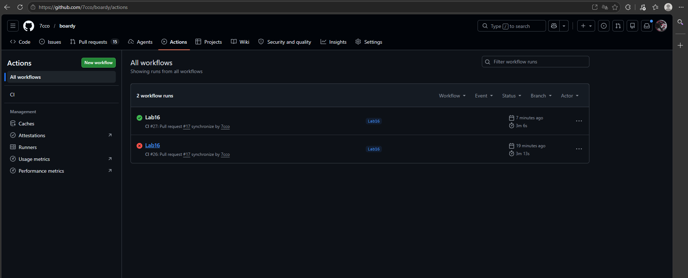

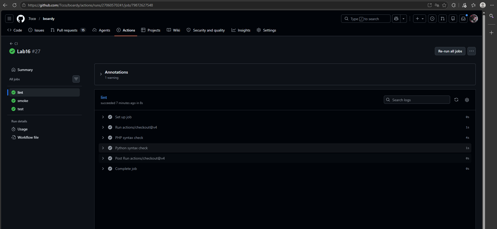
Lint стоит первым для реализации принципа fail fast: если код синтаксически невалиден, дальнейшие шаги бессмысленны и только тратят ресурсы. Он ловит синтаксические ошибки и битые импорты, но не ловит логические ошибки или ошибки выполнения бизнес-логики.

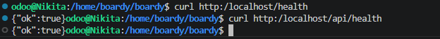
Эндпоинт /health не зависит от сложной бизнес-логики и базы данных, что позволяет CI и системам мониторинга мгновенно проверить, что сервис «жив». В продакшене этот паттерн повсеместно используется оркестраторами (например, Kubernetes) для автоматических health-check-ов и балансировки нагрузки.

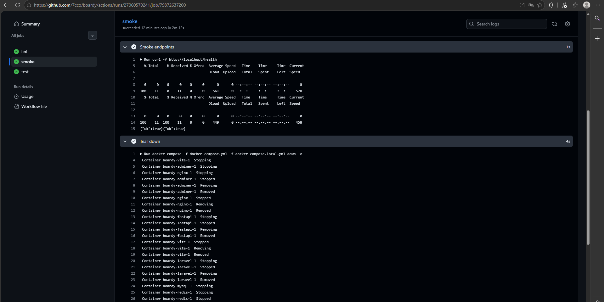
Smoke-тест ловит три класса поломок: ошибки сборки Docker-образов, некорректную конфигурацию docker-compose (сеть, переменные окружения) и падение приложения сразу после старта. Он не ловит ошибки в бизнес-логике, так как проверяет только базовую доступность и ответ 200 OK.

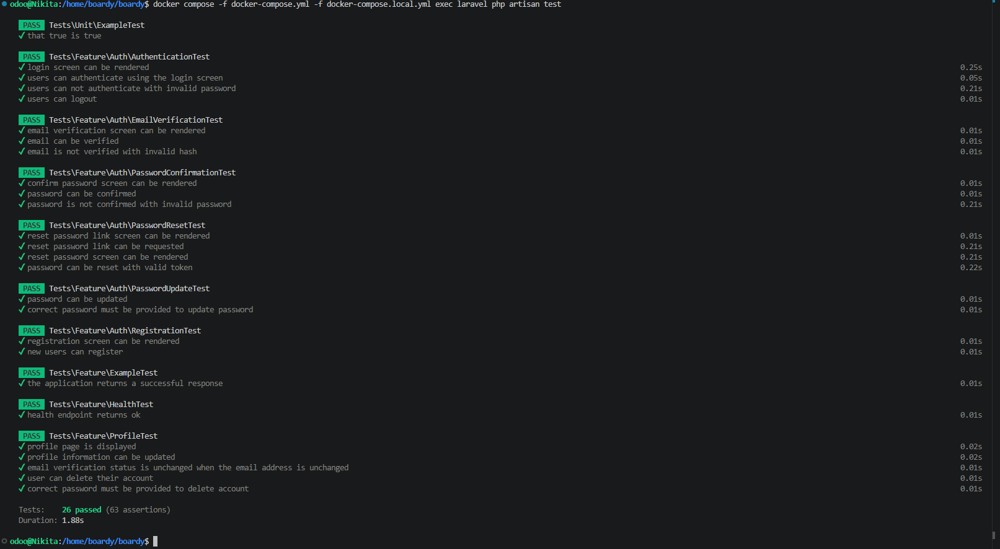

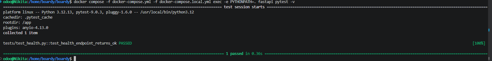
 
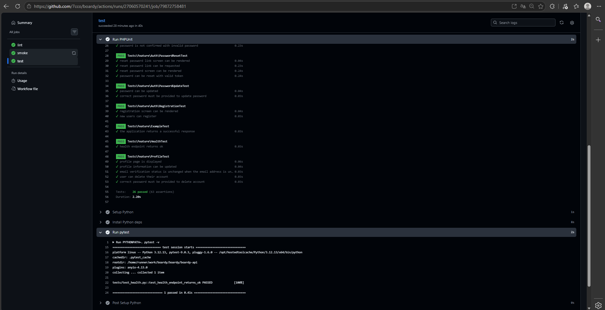
Тесты идут после smoke, потому что для их корректного запуска требуется успешно собранный и поднятый стек зависимостей. Если бы было наоборот, тесты могли бы упасть из-за проблем со сборкой или сетью, давая ложноположительные результаты о проблемах в самом коде приложения.

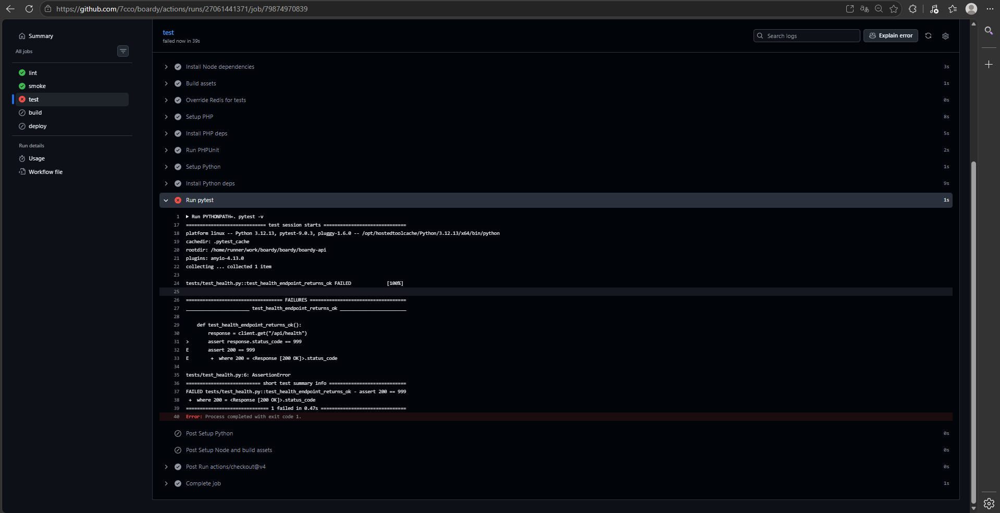

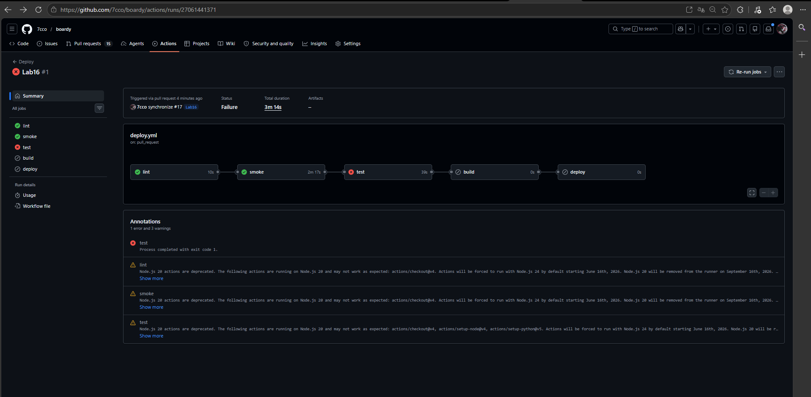

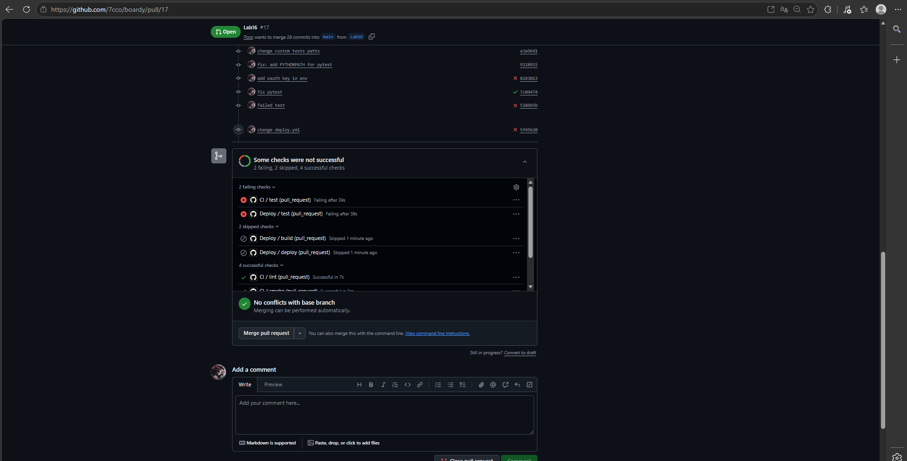
При ручном деплое сломанный код попал бы на продакшен, сайт упал бы, и разработчику пришлось бы тратить время на подключение по SSH, анализ логов и откат изменений. CI экономит от десятков минут до часов, мгновенно блокируя деплой и показывая ошибку прямо в интерфейсе GitHub до того, как код коснётся сервера.

1. Перейдите на вкладку Actions и выберите нужный упавший запуск (run). 2. В левой панели выберите job с названием "test". 3. Разверните список шагов и кликните на шаг запуска тестов (например, "Run pytest"). 4. В открывшемся текстовом логе найдите конкретную строку с ошибкой ассерта, именем файла и номером строки.

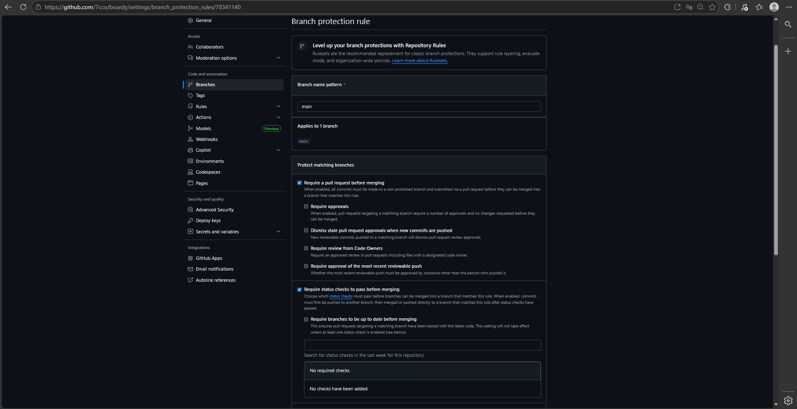
Сборка и деплой вынесены в отдельный файл, чтобы логически разделить проверку Pull Request и процесс релиза в ветку main. Повтор lint/smoke/test в deploy.yml гарантирует, что даже при прямом пуше в main (в обход PR-процесса) код всё равно пройдёт все проверки перед сборкой образов.

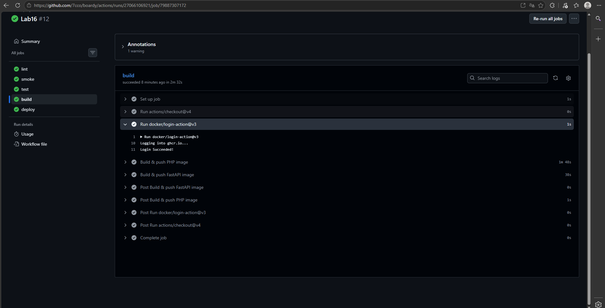
GITHUB_TOKEN — это автоматически создаваемый на каждый запуск воркфлоу токен для аутентификации внутри экосистемы GitHub. В отличие от обычных секретов, его не нужно создавать и ротировать вручную, и он имеет строго ограниченные, настраиваемые права только для текущего репозитория.

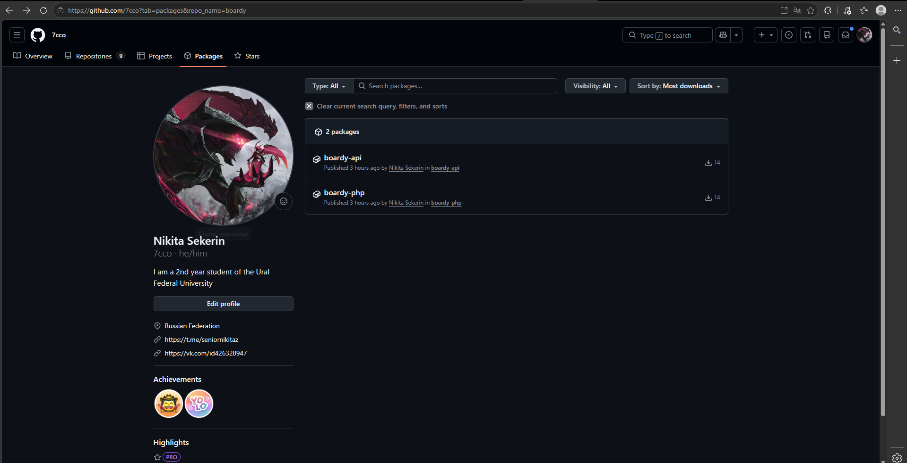
Тег github.sha обеспечивает точную привязку образа к конкретному коммиту для надёжного аудита и отката, а тег latest указывает на самую свежую сборку. Тег latest используется для простого и быстрого обновления на сервере, а SHA-тег — для гарантированного отката к конкретной проверенной версии.

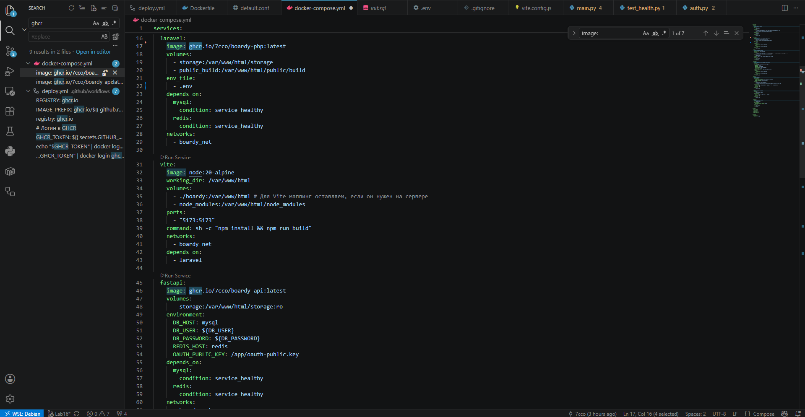
В практике 14 сервер сам собирал образы из исходников, что требовало времени и вычислительных ресурсов VPS. Теперь сборка происходит в CI, а сервер только скачивает и запускает готовые оптимизированные образы из GHCR, что ускоряет деплой и снижает нагрузку на продакшен.

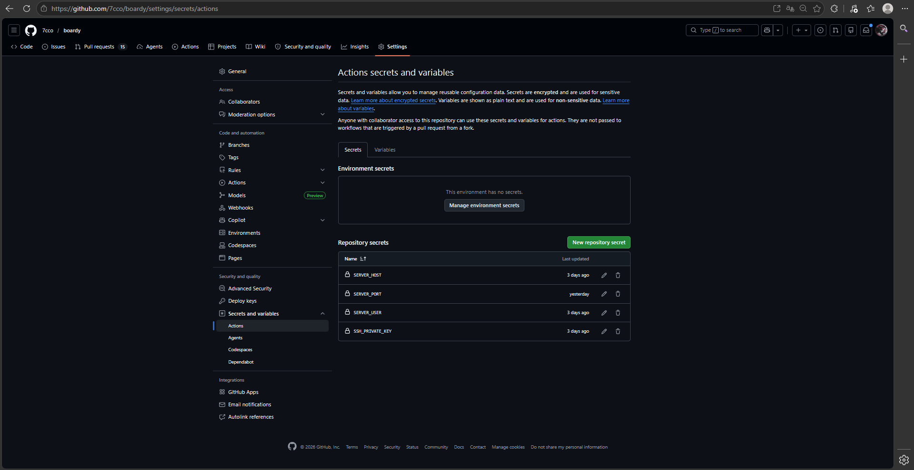
Отдельный ключ используется для минимизации рисков: если он скомпрометирован, злоумышленник получит доступ только к деплою этого проекта, а не ко всем вашим репозиториям. В случае утечки такой ключ легко отозвать и заменить новым, не затрагивая ваш личный доступ к GitHub и другим сервисам.

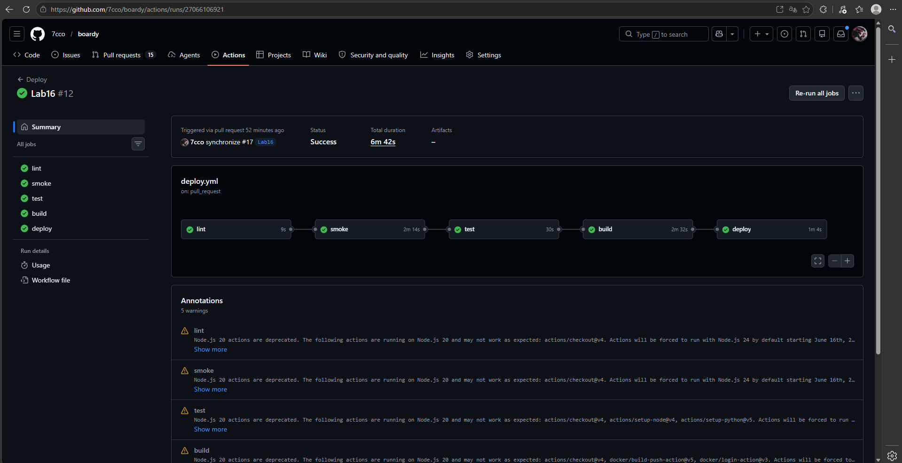

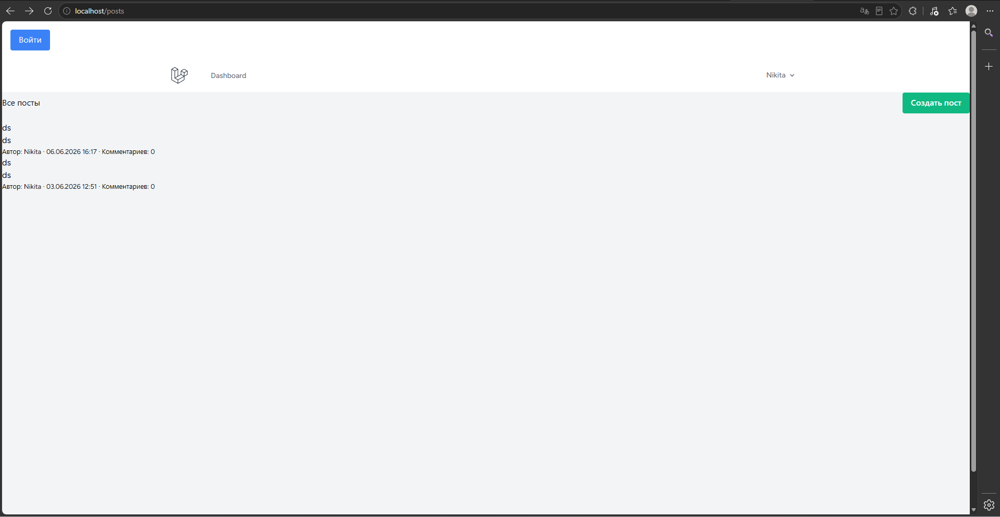
Для отката нужно изменить тег образа в docker-compose.yml на нужный SHA-хеш коммита и выполнить команды `docker compose pull` и `docker compose up -d`. Пересобирать ничего не нужно, так как сервер не компилирует код, а просто скачивает уже готовый, протестированный CI-пайплайном образ из реестра.

(1) Пининг версии action по SHA защищает от подмены тега злоумышленником, так как хеш коммита криптографически неизменен. (2) Запуск недоверенного кода через триггер pull_request_target опасен утечкой секретов, так как этот триггер имеет доступ к секретам базовой ветки (main). (3) Self-hosted runner в публичном репозитории опасен тем, что любой пользователь может создать PR и выполнить произвольный код с полными правами на вашей инфраструктуре.

1. Linux VM — нужен сервер для запуска приложения, без него nowhere to deploy.

2. SSH, VPS, Git — удалённое управление сервером и версионирование кода, без этого нельзя работать командой и деплоить.

3. NGINX, DNS — маршрутизация запросов и доменное имя, без этого сайт недоступен по человеческому адресу.

4. HTTP — понимание протокола для работы веб-приложения, без этого неясно как клиент общается с сервером.

5. HTTPS — безопасность передачи данных, без этого пароли и токены летят в открытом виде.

6. CGI — выполнение серверных скриптов, без этого PHP/Python код не запускается по запросу, первый бэкенд.

7. PHP-FPM и FastAPI — запуск PHP и Python приложений, без этого бэкенд не работает.

8. MySQL — хранение данных (пользователи, посты), без этого приложение Stateless и бесполезно.

9. REST API SSR vs CSR — взаимодействие фронтенда и бэкенда, без этого нет динамики и разделения ответственности.

10. Куки и сессии — сохранение состояния пользователя между запросами, без этого каждый запрос как первый.

11. JWT и OAuth — аутентификация и авторизация, без этого нельзя безопасно идентифицировать пользователя.

12. Laravel — фреймворк для быстрой разработки PHP-бэкенда, без этого писать всё с нуля долго и больно.

13. WebSocket — realtime коммуникация (уведомления, чат), без этого только polling и задержки.

14. Redis — кэширование и быстрые данные (сессии, очереди), без этого медленные запросы к БД на каждый чих.

15. Docker — воспроизводимость окружения, без этого "у меня работает, а на сервере нет".

Не сделал 16 скрин, потому что написал через self-hosted, пока не пробрасывал wsl в интернет.