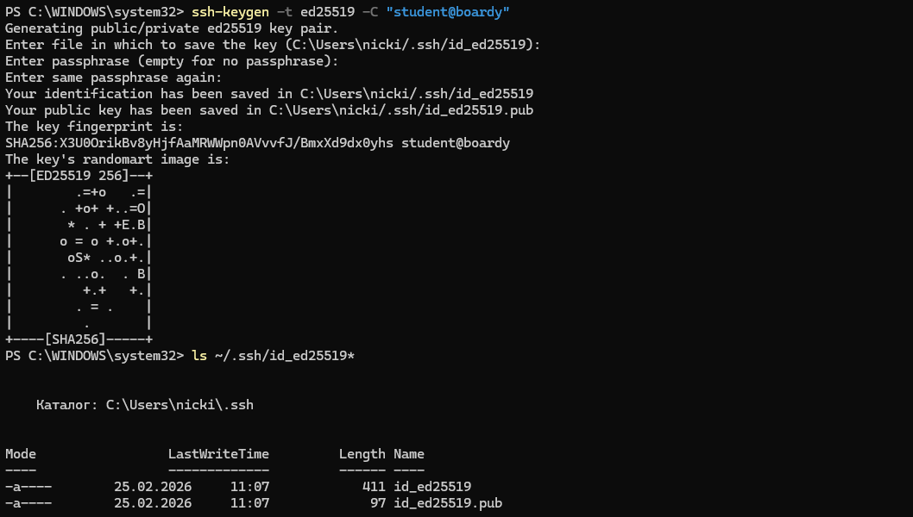
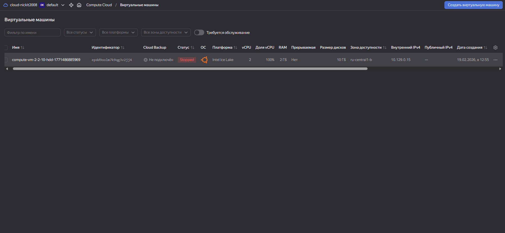
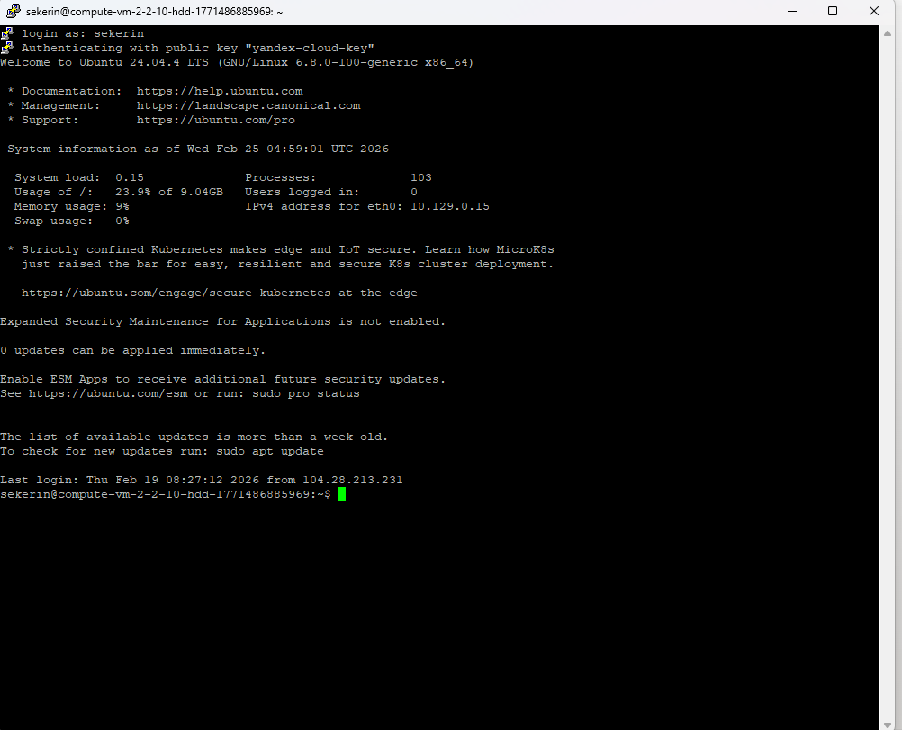
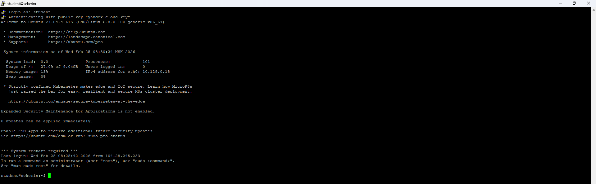
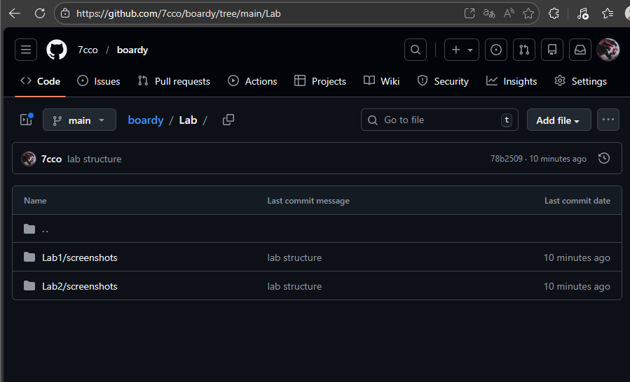
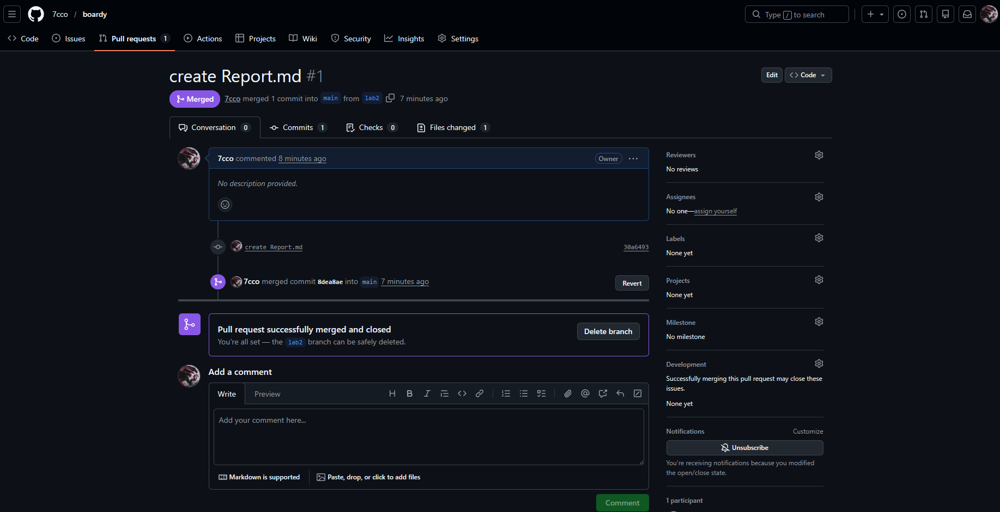

## Создание ssh-ключа

## VPS на yandexcloud
 

## Подключение через PuTTY

## Настройка сервера

## Новый пользователь student

## Настройки git-config и ssh-github

## репозиторий на GitHub с папками Lab/

## созданный PR на GitHub
