## Вывод systemctl status nginx (active)
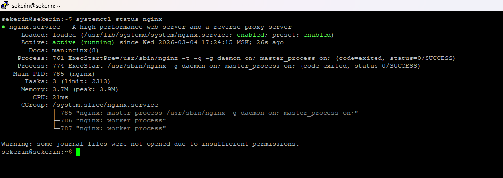

## Дефолтная страница Nginx в браузере
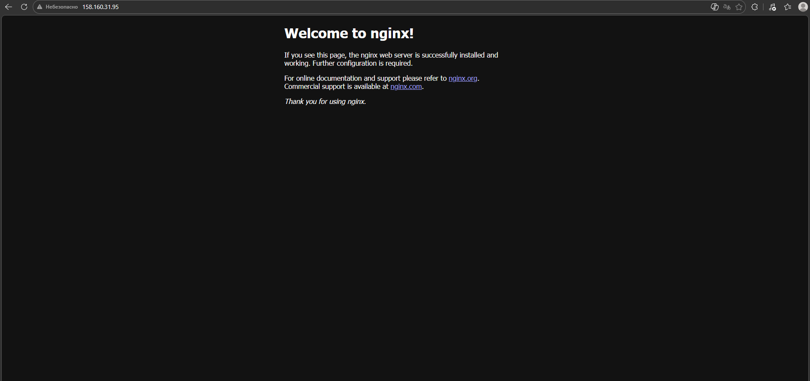

## Выводcurl -v
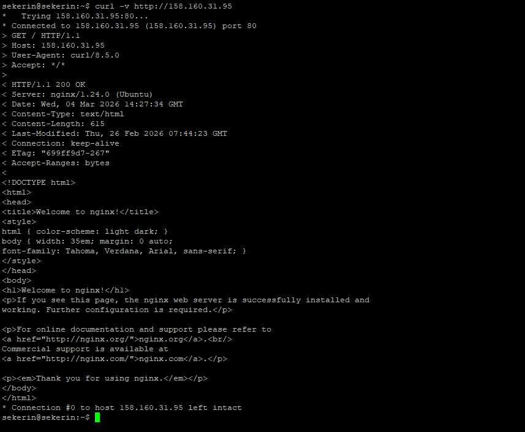

### GET / HTTP/1.1
### HTTP/1.1 200 OK
### Content-Type: text/html

## Вывод ls -la /var/www/
### До
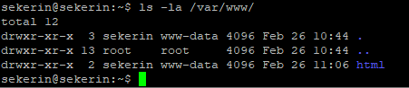
### После
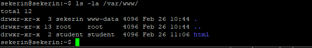

### listen 80 default_server
Директива указывает Nginx принимать HTTP-запросы на порту 80
### root /var/www/html
Директива задаёт корневую директорию для хранения файлов сайта
### server_name _
Директива определяет имена доменов, на которые давать ответ, _ используется для обработки любых запросов, не попавших в другие хосты.
### index 
index.html index.htm index.nginx-debian.html - Директива задаёт приоритетный список файлов, которые Nginx будет искать и отдавать при запросе директории

## Созданная зона
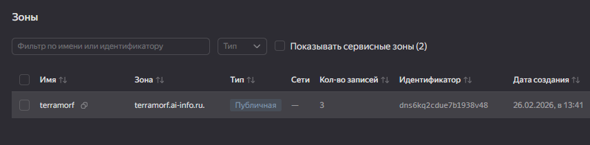

## A-запись
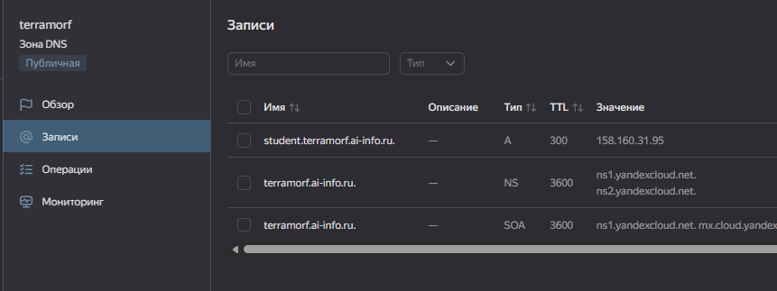

## Вывод ping
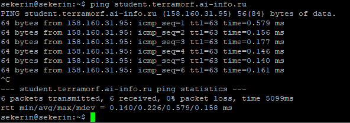

## Вывод dig
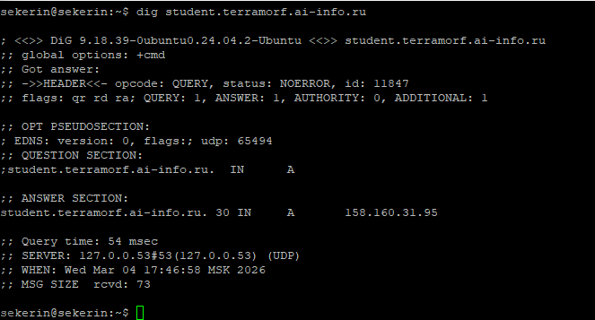
### QUESTION SECTION
student.terramorf.ai-info.ru.  IN      A
### ANSWER SECTION
student.terramorf.ai-info.ru. 54 IN     A       158.160.31.95
### SERVER
127.0.0.53#53(127.0.0.53) (UDP)

## Вывод dig +trace
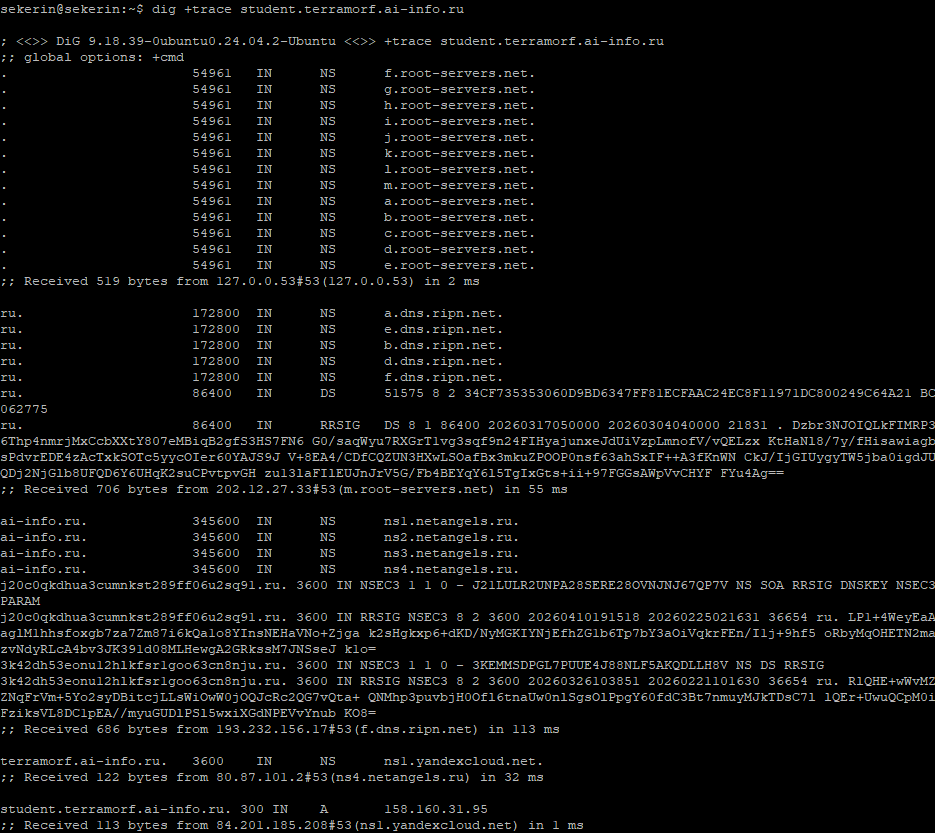
Запрос начался с локального резолвера (127.0.0.53), затем прошёл через корневой сервер m.root-servers.net (202.12.27.33) к TLD-серверу .ru f.dns.ripn.net (193.232.156.17), далее к авторитетному серверу ai-info.ru — ns4.netangels.ru (80.87.101.2), который делегировал поддомен terramorf.ai-info.ru на ns1.yandexcloud.net (84.201.185.208), и тот вернул финальную A-запись: student.terramorf.ai-info.ru (158.160.31.95)

## Страница Nginx в браузере
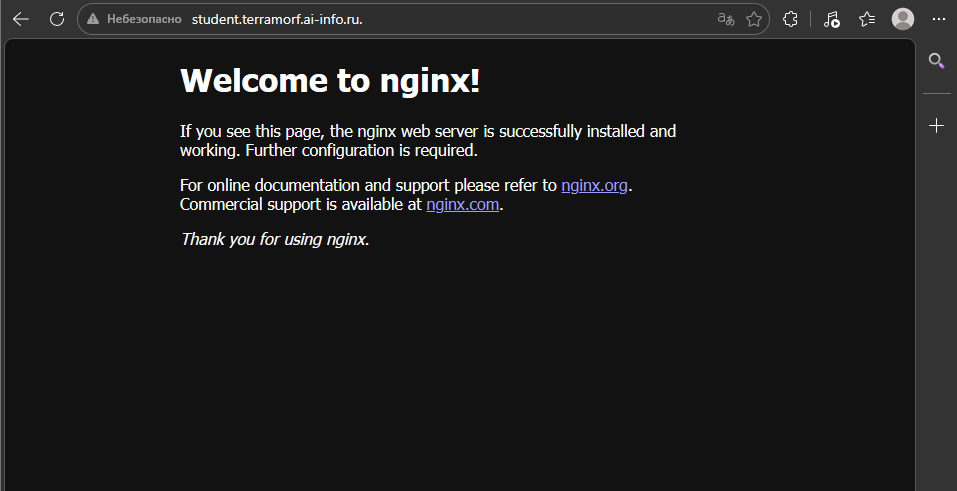