# 1) Установка certbot
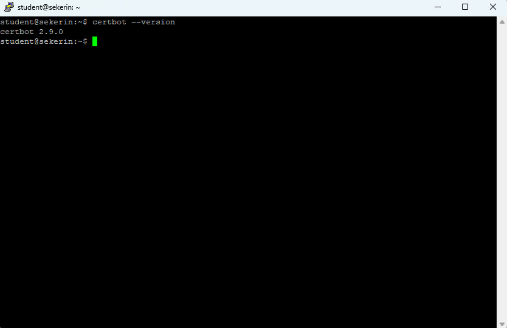

# 2) Получение сертификата
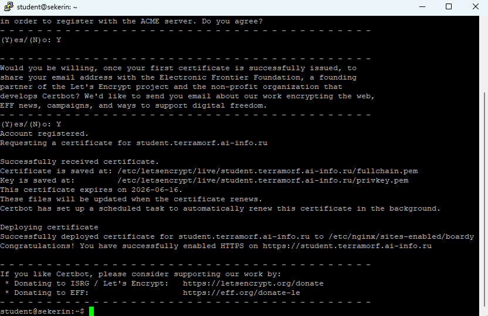

# 3) Проверка в браузере
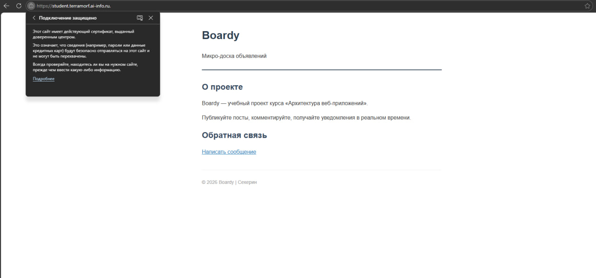

# 4) Информация о сертификате
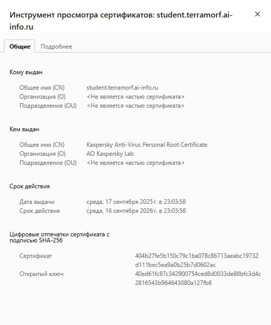

# 5) Редирект
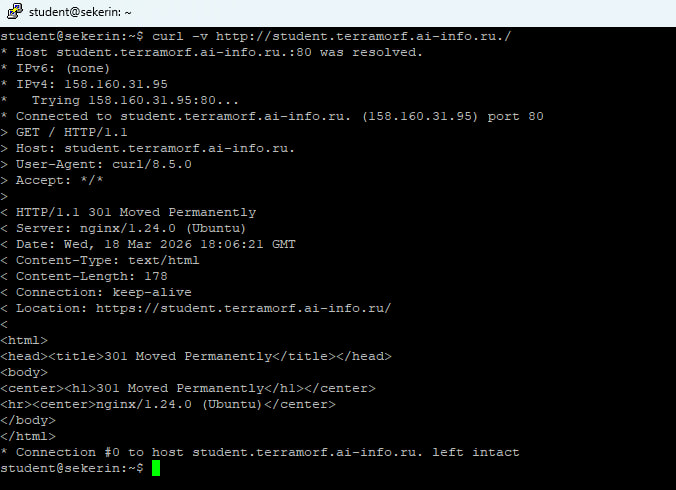

## 301 Moved Permanently
## Location: https://student.terramorf.ai-info.ru./

# 6) Конфиг после certbot
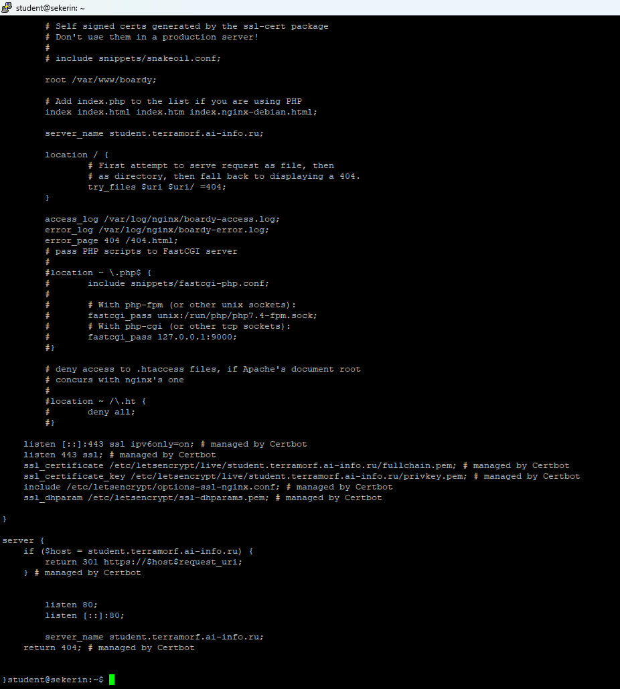

## listen 443 ssl; # managed by Certbot
## ssl_certificate /etc/letsencrypt/live/student.terramorf.ai-info.ru/fullchain.pem; # managed by 
## ssl_certificate_key /etc/letsencrypt/live/student.terramorf.ai-info.ru/privkey.pem; # managed by Certbot

# 7) Сертификат для api-поддомена
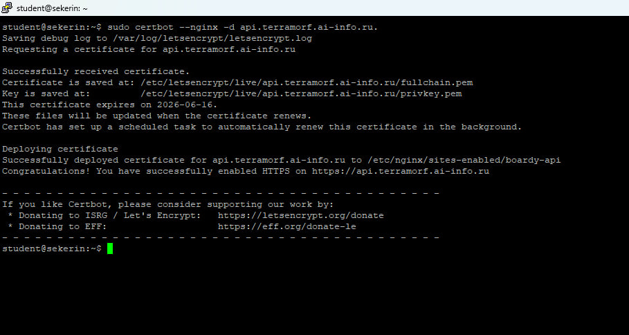

# 8) Проверка обоих доменов
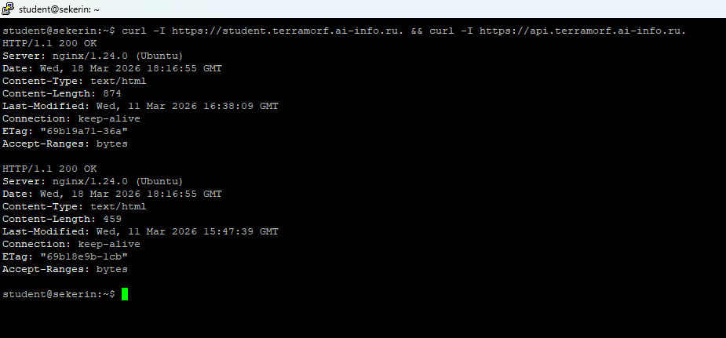

# 9) TLS handshake
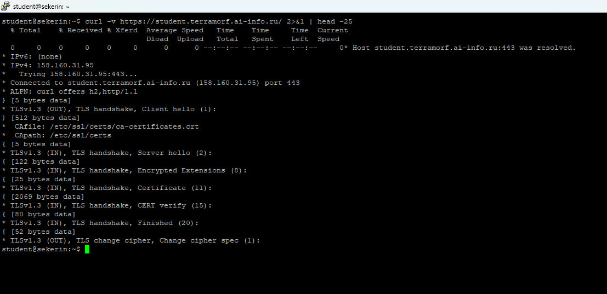

## **Версия TLS:** TLSv1.3
## **Алгоритм шифрования:** TLS_AES_256_GCM_SHA384
## **Subject:** CN=student.terramorf.ai-info.ru
## **Issuer:** C=US, O=Let's Encrypt, CN=E7
## **Срок действия:** 18 марта 2026 - 16 июня 2026

# 10) Цепочка доверия
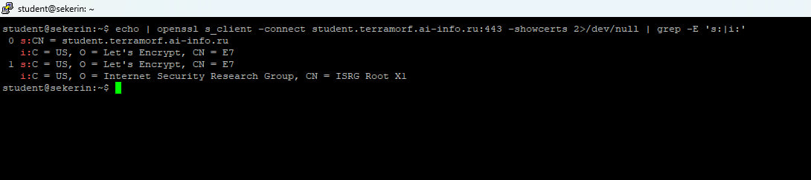

## **Корневой CA (Root)**
###   Subject: C=US, O=Internet Security Research Group, CN=ISRG Root X1
###  
### ↓ подписывает
###
## **Промежуточный CA (Intermediate)**
###  Subject: C=US, O=Let's Encrypt, CN=E7
###   Issuer:  C=US, O=Internet Security Research Group, CN=ISRG Root 
###  
### ↓ подписывает
###
## **Сертификат сайта (Leaf/End-entity)**
###   Subject: CN=student.terramorf.ai-info.ru
###   Issuer:  C=US, O=Let's Encrypt, CN=E7

# 11) Сравнение сертификатов
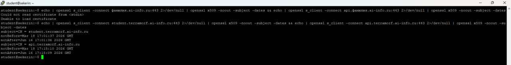

## **Общее:**
### 1) Срок действия
### 2) Дата выдачи
### 3) Дата истечения
### 4) Доменная зона
### 5) Центр сертификации
###
## **Различия:**
### 1) Common Name (CN)
### 2) Время выдачи
### 3) Время истечения

# 12) HSTS
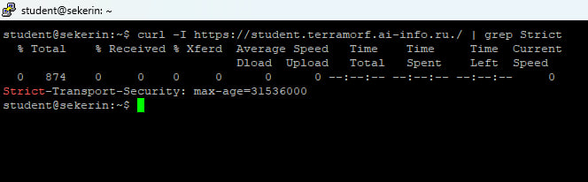

## **HSTS** — это политика безопасности, которая предписывает браузеру взаимодействовать с сайтом только через зашифрованное HTTPS-соединение, блокируя любые незащищённые HTTP-запросы. Это защищает пользователей от атак понижения протокола (SSL stripping) и перехвата сессионных cookies, так как браузер автоматически заменяет http:// на https:// ещё до отправки данных.

# 13) Кэширование и gzip
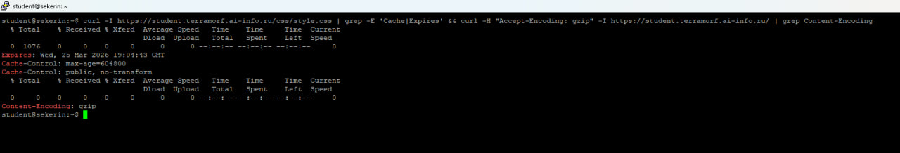

# 14) Автообновление
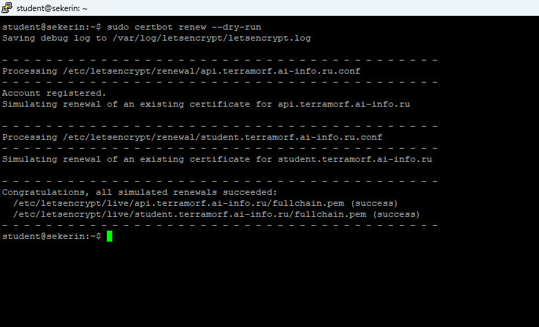

# 15) Pull Request
