# Вывод systemctl status fcgiwrap (active)
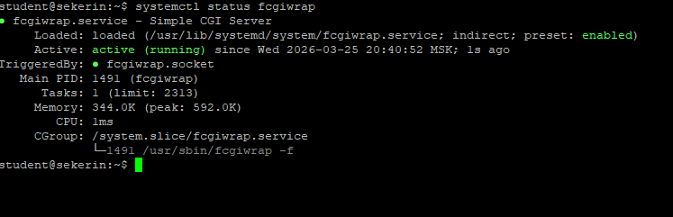

# Выводит время, метод, IP, User-Agent.
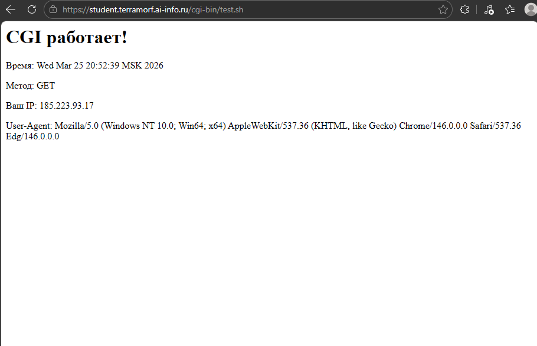

# Добавленный блок location в конфиге
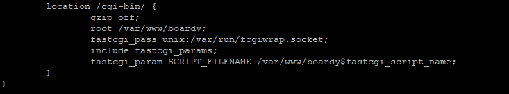

## fastcgi_pass 
указывает, куда Nginx должен передавать запросы для обработки FastCGI 
unix: - означает использование Unix-сокета
/var/run/fcgiwrap.socket - путь к сокету, через который работает FastCGI-процесс

## include fastcgi_params 
подключает стандартный файл с параметрами FastCGI

## SCRIPT_FILENAME 
определяет полный путь к исполняемому CGI-скрипту на сервере

# Вывод curl -X POST -d "name=...&message=..."
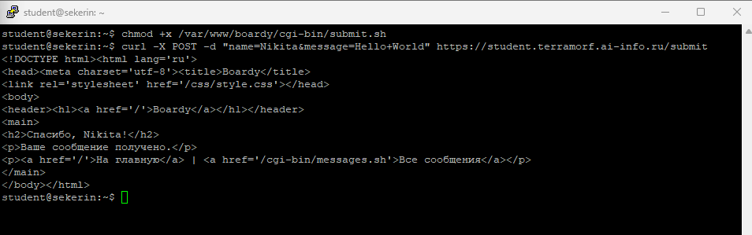

# Страница «Спасибо, {ваше имя}!» в браузере
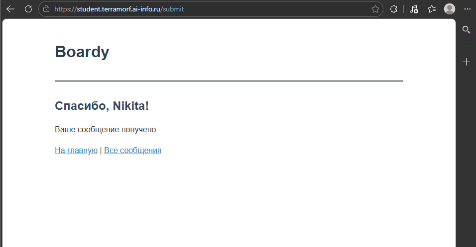

# Содержимое файла (минимум 3 сообщения)
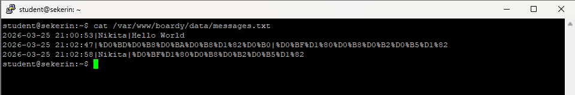

# Страница сообщений в браузере (таблица с данными)
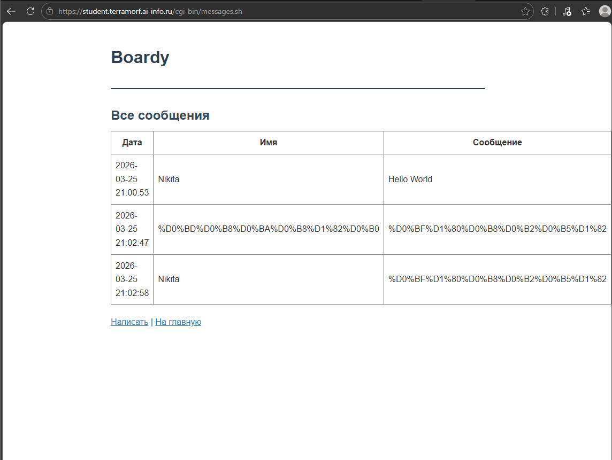


# Полный цикл
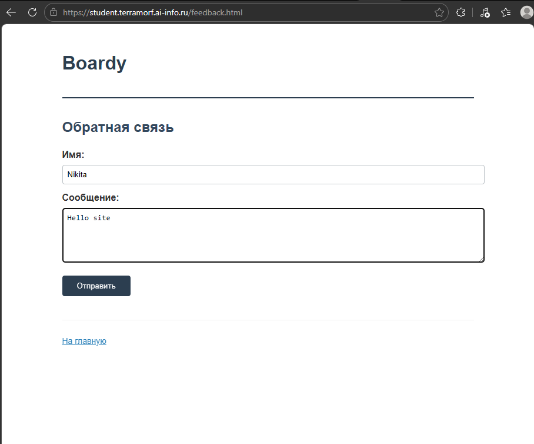

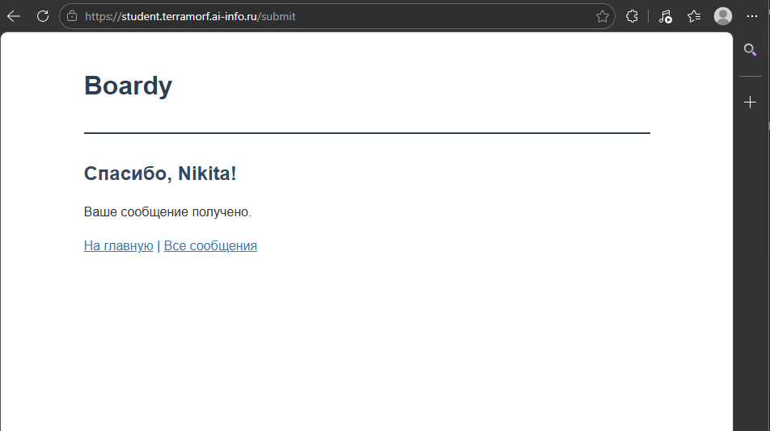

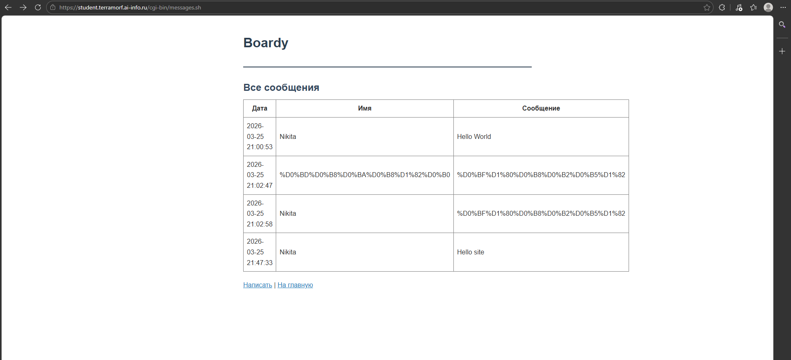

# Путь запроса
```
┌─────────────┐
│   БРАУЗЕР   │
└──────┬──────┘
       │ POST /cgi-bin/submit.sh
       │ HTTPS (шифрование)
       ▼
┌─────────────┐
│    NGINX    │ ← location /cgi-bin/
└──────┬──────┘   fastcgi_pass
       │ FastCGI запись
       │ (переменные окружения + POST data)
       ▼
┌─────────────┐
│  FCGIWRAP   │ ← Unix socket
└──────┬──────┘
       │ fork() + exec()
       │ Переменные окружения
       │ POST data → stdin
       ▼
┌─────────────┐
│  submit.sh  │
│ (CGI script)│
└──────┬──────┘
       │
       ├─── stdin  ← данные формы
       │    │
       │    ▼
       │  Обработка
       │    │
       │    ▼
       │  messages.txt (запись на диск)
       │
       └─── stdout → "Content-Type: text/html\n\nOK"
             │
             ▼
       ┌─────────────┐
       │  FCGIWRAP   │
       └──────┬──────┘
              │ FastCGI ответ
              ▼
       ┌─────────────┐
       │    NGINX    │
       └──────┬──────┘
              │ HTTPS ответ
              ▼
       ┌─────────────┐
       │   БРАУЗЕР   │ ← Отображение результата
       └─────────────┘
```

# Теоретические вопросы
1. Что такое CGI и какую проблему он решил в 1993 году?
CGI (Common Gateway Interface) — это стандартный протокол, позволяющий веб-серверу запускать внешние программы для генерации динамического контента. В 1993 году он решил проблему статичности веб-страниц, дав возможность обрабатывать пользовательские формы и взаимодействовать с базами данных.

2. Как CGI-скрипт получает данные POST-запроса?
CGI-скрипт получает данные POST-запроса через stdin. Количество байт для чтения определяется значением переменной окружения CONTENT_LENGTH.

3. Почему CGI создаёт проблемы при высокой нагрузке?
Классический CGI создаёт новый процесс операционной системы для каждого отдельного запроса, что требует значительных ресурсов процессора и памяти. При высокой нагрузке это приводит к большим накладным расходам на создание и уничтожение процессов, снижая общую производительность сервера.

4. Чем отличается fastcgi_pass от proxy_pass?
Директива fastcgi_pass передаёт запросы по протоколу FastCGI специальному обработчику процессов, используя переменные окружения для передачи метаданных. В отличие от неё, proxy_pass перенаправляет запросы по обычному HTTP/HTTPS протоколу на другой веб-сервер или балансировщик.

5. Зачем нужен fcgiwrap, если Apache запускает CGI напрямую?
Веб-сервер Nginx не имеет встроенной поддержки запуска CGI-скриптов, в отличие от Apache с его модулем mod_cgi. Fcgiwrap выступает промежуточным слоем, позволяющим Nginx взаимодействовать с обычными CGI-программами через протокол FastCGI.

# PR на GitHub
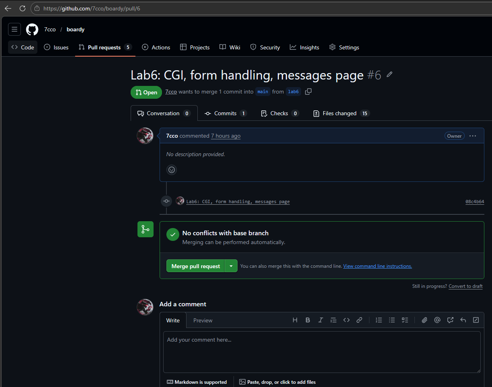